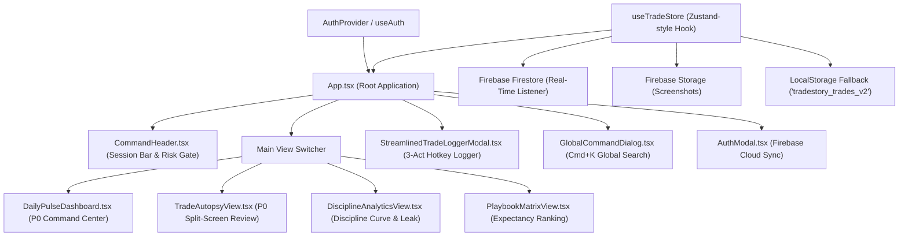

# TradeTale (Tradestory) — Detailed Project Documentation & Architectural Blueprint

> **"Transforming trade journaling from a passive retrospective ledger into an active, three-act narrative and quantitative behavioral autopsy engine."**

---

## 1. Executive Summary & Vision

### 1.1 The Core Problem in Financial Trading
Traditional trading journals (such as TraderSync, Edgewonk, or standard Google Sheets/Excel spreadsheets) operate as **passive retrospective ledgers**. They suffer from fundamental structural flaws:
1. **Vanity Metric Bias**: They emphasize gross fiat profit ($) rather than **repeatable mathematical edge** and **process execution**. A trader who gambles 20% of their account on an earnings announcement and makes $5,000 is rewarded by a spreadsheet, even though the decision was mathematically catastrophic.
2. **The "Discipline Leak" is Invisible**: Traders know when they make emotional mistakes (revenge trading, widening stops, FOMO impulse entries), but conventional journals cannot calculate the **exact cumulative dollar and R-multiple cost** of those rule violations.
3. **Decoupled Planning vs. Execution**: Setups are planned on charting platforms (TradingView, NinjaTrader) before market open, but trades are only logged hours or days later. By that time, the psychological neuro-state, emotional triggers, and structural thesis are lost.

### 1.2 The TradeTale Solution
**TradeTale** (internally known as **Tradestory**) re-engineers trade recording into an **active three-act narrative** and **behavioral autopsy system**:
- **Normalized Units of Risk ($R$-Multiples)**: Eliminates fiat distortion by measuring every outcome relative to pre-defined risk ($1R$).
- **Discipline Overlay Curve**: Simultaneously charts a trader's **Actual Realized Equity** alongside their **Theoretical 100% Rule-Adherent Equity**, isolating the exact cost of indiscipline.
- **The 3-Act Narrative Logger**: Captures **Act I (The Pre-Trade Thesis)**, **Act II (Live Execution & Neuro-State)**, and **Act III (The Autopsy & Rule Compliance)**.
- **Daily Drawdown Safety Gate**: Real-time risk governance enforcing daily maximum loss thresholds (e.g. $-3R$ or $-\$1,000$) to protect funded prop firm traders and discretionary accounts.
- **Playbook Edge Matrix**: Mathematically calculates the expectancy ($E$) of every distinct setup model, surfacing high-probability setups and flagging negative-expectancy patterns for retirement.

---

## 2. Core Mathematical & Quantitative Models

### 2.1 Normalized Risk Units ($R$-Multiple)
In TradeTale, every trade is standardized into risk units ($R$) based on the initial planned risk denominator:
$$\text{Initial Risk (\$) } = 1R = | \text{Planned Entry} - \text{Planned Stop} | \times \text{Position Size}$$
$$\text{Realized } R = \frac{\text{Net P&L (\$) } - \text{Fees \& Commissions}}{\text{Initial Risk (\$) }}$$

*Benefits:*
- Equities ($10,000 capital), Micro Futures ($50/pt), and Crypto (0.1 BTC) can be compared on the same scale.
- Eliminates account balance distortion across growth phases.

### 2.2 Mathematical Expectancy ($E$)
For each playbook setup (e.g., *Fair Value Gap Sweep*, *ORB Breakout*, *Liquidity Raid*), the system evaluates:
$$E = (W \times \overline{R}_w) - (L \times \overline{R}_l)$$
Where:
- $W$ = Win Rate percentage
- $\overline{R}_w$ = Average $R$-Multiple gained on winning trades
- $L = 1 - W$ = Loss Rate percentage
- $\overline{R}_l$ = Average $R$-Multiple lost on losing trades (ideally $\le 1.0R$)

If $E \le 0$, the setup has no statistical edge and is flagged with an automated **"RETIRE SETUP"** warning in the [PlaybookMatrixView](file:///c:/Users/Mahmoud/Desktop/TradeTale/src/components/playbook/PlaybookMatrixView.tsx).

### 2.3 Discipline Leak Delta ($\Delta R_{\text{leak}}$)
TradeTale calculates the monetary and risk penalties incurred strictly due to non-compliant trades (trades where one or more golden rules were violated):
$$\Delta R_{\text{leak}} = \sum R_{\text{compliant}} - \sum R_{\text{actual}}$$
$$\text{Fiat Leak (\$) } = \sum \text{Cost of Non-Compliant Trades \& Widened Stops}$$

This metric is rendered dynamically in the [DisciplineAnalyticsView](file:///c:/Users/Mahmoud/Desktop/TradeTale/src/components/analytics/DisciplineAnalyticsView.tsx), answering the vital question: *"How much money would I have if I simply followed my rules 100% of the time?"*

### 2.4 Rule Adherence Index (RAI)
$$\text{RAI} = \left( \frac{\text{Number of 100\% Compliant Trades}}{\text{Total Trades Logged}} \right) \times 100\%$$
- Target: **$\ge 90\%$** across all logged sessions.

---

## 3. Product Architecture & Feature Modules



---

### 3.1 Module 1: The Daily Pulse Dashboard
Located at [src/components/dashboard/DailyPulseDashboard.tsx](file:///c:/Users/Mahmoud/Desktop/TradeTale/src/components/dashboard/DailyPulseDashboard.tsx).
- **Session Telemetry**: Live status indicators for global market hours:
  - `TOKYO / ASIA` (00:00–06:00 UTC)
  - `LONDON OPEN` (07:00–11:00 UTC)
  - `NY AM OPEN` (13:30–16:00 UTC)
  - `NY LUNCH` (16:00–18:00 UTC)
  - `NY PM CLOSE` (18:00–20:00 UTC)
- **Top Command KPIs**:
  - Daily Realized $R$ (e.g. `+4.25R`) with fiat translation (`+$2,125.00`).
  - Plan Adherence Badge (e.g. `94.0% Plan Adherence`).
  - Win Rate and Total Trades count.
- **Drawdown Safety Gate**:
  - Live progress meter tracking consumed daily risk against maximum daily loss allowance (e.g. `$340 / $1,000 Safe Zone`).
  - Warning alarms if the trader crosses $-2R$ or breaches the maximum daily loss ceiling.
- **Process Discipline Heatmap**:
  - GitHub-style 35-to-90 day visual matrix.
  - Colors encode execution fidelity: **Emerald** for compliant green days, **Slate/Muted** for clean compliant losses (good losses), and **Crimson** for rule-violation losses.
  - Displays consecutive streak counters (`18-Session Zero Revenge Entries`).
- **Chronological Execution Stream**:
  - Interactive cards showing instrument ticker, direction (`LONG`/`SHORT`), setup tag, entry/exit prices, realized $R$, adherence badge, and a one-click **"Autopsy"** button.

---

### 3.2 Module 2: The 3-Act Narrative Trade Logger
Located at [src/components/logger/StreamlinedTradeLoggerModal.tsx](file:///c:/Users/Mahmoud/Desktop/TradeTale/src/components/logger/StreamlinedTradeLoggerModal.tsx) and [ThreeActTradeLoggerModal.tsx](file:///c:/Users/Mahmoud/Desktop/TradeTale/src/components/logger/ThreeActTradeLoggerModal.tsx).

The logger splits trade capture into psychological moments:

| Act | Phase | Fields Captured | Key Value |
|---|---|---|---|
| **Act I** | **The Thesis** *(Pre-Trade)* | Instrument, Asset Class (Futures, Forex, Equities, Crypto), Direction, Strategy Setup, Anchor & Execution Timeframes, Planned Entry, Stop, Target, Planned R:R Ratio, Thesis Notes, Pre-Trade Screenshot | Prevents retrospective justification; forces trader to define invalidation before taking risk. |
| **Act II** | **Live Execution** *(The Order)* | Executed Entry, Executed Stop, Position Size (contracts/shares/lots), Slippage Offset, Execution Timestamp, **Neuro-State Selector** | Tracks execution friction and biometric mindset: `Calm & Centered`, `FOMO Urge`, `Hesitant`, `Chasing Price`, `Revenge / Tilted`. |
| **Act III** | **The Autopsy** *(Post-Trade)* | Executed Exit, Gross P&L, Fees/Commissions, Net P&L, Realized $R$, Post-Trade Screenshot, **Pass/Fail Compliance Checklist**, **3-Line Structured Narrative** | Enforces instant post-mortem analysis: 1. *What worked*, 2. *What failed*, 3. *The lesson*. |

---

### 3.3 Module 3: Trade Autopsy Split-View
Located at [src/components/autopsy/TradeAutopsyView.tsx](file:///c:/Users/Mahmoud/Desktop/TradeTale/src/components/autopsy/TradeAutopsyView.tsx) and [DualImageCanvas.tsx](file:///c:/Users/Mahmoud/Desktop/TradeTale/src/components/canvas/DualImageCanvas.tsx).
- **Pre vs. Post Chart Dual Canvas**: Side-by-side comparative inspection of the technical setup before entry versus the market's realized path after exit.
- **Dual Timeline Trajectory Visualizer**: Compares the planned market trajectory against the realized trajectory.
- **Rule Adherence Breakdown**: Interactive checklist reviewing whether:
  - Key timeframe confirmation closed.
  - Stop loss was placed at structural invalidation.
  - Position size adhered strictly to the 1R dollar budget.
  - Take-profit was respected without premature emotion-based exits.
- **Biometric & Mindset Audit**: Highlights the emotional state when entering and exiting, linking psychology directly to the trade result.

---

### 3.4 Module 4: Discipline Analytics & Mistake Diagnostics
Located at [src/components/analytics/DisciplineAnalyticsView.tsx](file:///c:/Users/Mahmoud/Desktop/TradeTale/src/components/analytics/DisciplineAnalyticsView.tsx) and [src/components/diagnostics/MistakeDiagnosticEngine.tsx](file:///c:/Users/Mahmoud/Desktop/TradeTale/src/components/diagnostics/MistakeDiagnosticEngine.tsx).
- **The Discipline Overlay Curve**:
  - **Line A (Emerald)**: Theoretical equity curve achieved with 100% rule adherence.
  - **Line B (Rose/Red)**: Realized equity curve including emotional and undisciplined trades.
- **Discipline Leak Summary**:
  - Highlights total capital and $R$-multiples forfeited to undisciplined entries, widened stops, and revenge trading.
- **Neuro-State Expectancy Matrix**:
  - Analyzes win rate, trade volume, and average $R$ segmented by psychological state (`Calm`, `FOMO`, `Chasing`, `Revenge`, `Hesitant`).
- **Granular Mistake Taxonomy**:
  - Categorized under: `Entry`, `Risk Management`, `Exit`, `Psychology`.
  - Severity tiers: `Minor`, `Moderate`, `Severe`, `Catastrophic`.
  - Displays direct dollar and $R$ cost for each mistake type.

---

### 3.5 Module 5: Playbook Matrix & Expectancy Engine
Located at [src/components/playbook/PlaybookMatrixView.tsx](file:///c:/Users/Mahmoud/Desktop/TradeTale/src/components/playbook/PlaybookMatrixView.tsx).
- Lists all active strategy models (e.g. *Liquidity Sweep & FVG Return*, *Opening Range Breakout*, *Supply Zone Rejection*).
- Displays total executions, win rate %, average win $R$, average loss $R$, and calculated **Mathematical Expectancy ($E$)**.
- Automatically flags edge degradation and recommends retiring setups with negative expectancy.

---

### 3.6 Module 6: Global Command Palette (`Cmd + K`)
Located at [src/components/search/GlobalCommandDialog.tsx](file:///c:/Users/Mahmoud/Desktop/TradeTale/src/components/search/GlobalCommandDialog.tsx).
- Instant keyboard navigation:
  - `Cmd + K` or `Ctrl + K`: Open search palette.
  - `N`: Instantly launch the 3-Act Trade Logger.
  - `Esc`: Close any active modal.
- Search across instruments (NQ, ES, TSLA, EUR/USD), setup names, sessions, compliance tags, and autopsy notes.

---

### 3.7 Module 7: Firebase Cloud Infrastructure & Offline Resilience
Located at [src/lib/firebase.ts](file:///c:/Users/Mahmoud/Desktop/TradeTale/src/lib/firebase.ts) and [src/services/tradeService.ts](file:///c:/Users/Mahmoud/Desktop/TradeTale/src/services/tradeService.ts).
- **Authentication**: Firebase Auth supporting Email/Password sign-up, Google OAuth, and automatic Guest Mode.
- **Cloud Firestore**: Real-time two-way synchronization via `onSnapshot` listeners. User trades are scoped by `userId`.
- **Firebase Storage**: Cloud upload for pre-trade and post-trade chart screenshots with automatic URL resolution.
- **Zero-Friction Offline Fallback**: If Firebase is disconnected or offline, TradeTale automatically falls back to `localStorage` (`tradestory_trades_v2`) and pre-seeded realistic baseline trades.

---

---

### 3.8 Module 8: Procedural Candlestick Chart Engine
Located at [src/lib/chartGenerator.ts](file:///c:/Users/Mahmoud/Desktop/TradeTale/src/lib/chartGenerator.ts).
- Generates algorithmic, mathematically realistic SVG candlestick charts for pre-trade and post-trade views.
- Automatically plots dynamic price grids, candlestick bodies with shadows, volume histograms, structural annotations, and planned entry/stop/target guides.

---

### 3.9 Module 9: Landing & Presentation Page (Root Entry)
Located at [src/components/landing/LandingPage.tsx](file:///c:/Users/Mahmoud/Desktop/TradeTale/src/components/landing/LandingPage.tsx).
- High-conversion public front door and mandatory authentication gateway for all operators.
- Presents the core project philosophy ("Separate Market Randomness from Execution Discipline") and quantitative models ($R$-multiples, Discipline Leak Delta, Expectancy).
- Unauthenticated visitors are guided directly to either **"Create Free Account"** (starts registration $\rightarrow$ immediately launches the 4-Question Interactive Blueprint) or **"Log In to Existing Account"**.
- Interactive tabbed feature switcher previewing the 3-Act Logger, Trade Autopsy Split-View, and Discipline Overlay Curve.

---

### 3.10 Module 10: 4-Step Interactive Discipline Blueprint (Q&A Wizard)
Located at [src/components/onboarding/OnboardingWizardModal.tsx](file:///c:/Users/Mahmoud/Desktop/TradeTale/src/components/onboarding/OnboardingWizardModal.tsx) and [src/services/userRuleService.ts](file:///c:/Users/Mahmoud/Desktop/TradeTale/src/services/userRuleService.ts).
- 4-question interactive wizard triggered automatically upon registration or accessible anytime via the **"Rules"** button:
  1. **Question 1: Strategy Used**: Selection of primary setup models (Fair Value Gap / FVG & Liquidity Sweep, Opening Range Breakout / ORB, Supply & Demand Order Blocks, VWAP Reversion, Break & Retest, or Custom Strategy) plus minimum planned R:R ratio.
  2. **Question 2: The Session**: Approved market session windows (New York AM Open 09:30–11:30, London Open 03:00–07:00, New York PM Close 13:30–16:00, Tokyo/Asia) with active warning banners against the NY Lunch Chop window.
  3. **Question 3: Number of Trades Taken & Position Sizing**: Enforcing maximum trades allowed per session (2 Sniper, 3 Standard, 5 Scalper) and maximum contract/lot sizing per trade to prevent overtrading.
  4. **Question 4: The Main Question Asked When Journaling a Trade**: Trader selects or writes their #1 signature post-mortem question (e.g., *"Did I wait for structural confirmation, or did I enter impulsively out of FOMO?"*), which is anchored at the top of every Act III Autopsy.
- Synchronizes user rules to Firestore (`user_trading_rules` collection) and local cache, dynamically feeding the Daily Drawdown Risk Gate and Trade Logger.

---

### 3.11 Module 11: Real-Time Broker Access & Connection Vault
Located at [src/components/broker/BrokerVaultModal.tsx](file:///c:/Users/Mahmoud/Desktop/TradeTale/src/components/broker/BrokerVaultModal.tsx) and [src/services/brokerService.ts](file:///c:/Users/Mahmoud/Desktop/TradeTale/src/services/brokerService.ts).
- Secure account linking for **Tradovate**, **Interactive Brokers**, **TradeStation**, and **MetaTrader 5 / Prop Firm Bridges**.
- Real-time latency checks (`18ms WebSocket OK`), live account equity balances, and margin monitoring.
- **1-Click Auto-Fill Integration**: Detects incoming executions and allows the trader to auto-populate Act II (Live Execution) and Act III (Realized P&L, commissions, timestamps, fill prices) into the Trade Logger modal, allowing the trader to focus 100% on the qualitative thesis and behavioral autopsy.

---

### 3.12 Module 12: Mobile PWA Foundation & Responsive Architecture
Located at [public/manifest.json](file:///c:/Users/Mahmoud/Desktop/TradeTale/public/manifest.json), [public/sw.js](file:///c:/Users/Mahmoud/Desktop/TradeTale/public/sw.js), and [src/registerSW.ts](file:///c:/Users/Mahmoud/Desktop/TradeTale/src/registerSW.ts).
- Full Progressive Web App (PWA) installability across iOS, Android, macOS, and Windows.
- Service worker precaching of the app shell and static assets for instant offline loading.
- Mobile-first responsive layouts with collapsible hamburger drawers, adaptive command headers, touch-friendly dual-canvas sliders, and responsive grid stacking.

---

## 4. Codebase Directory Map

```text
TradeTale/
├── public/                     # Static assets, icons, and PWA configuration
│   ├── favicon.svg             # Vector favicon
│   ├── logo.png                # Brand identity logo
│   ├── manifest.json           # PWA web manifest
│   ├── manifest.webmanifest    # Web manifest alias
│   └── sw.js                   # PWA Service Worker for offline caching
├── src/
│   ├── assets/                 # SVGs and graphics
│   ├── components/             # React UI components
│   │   ├── analytics/          # Discipline overlay curve, leak metrics, neuro-state tables
│   │   │   └── DisciplineAnalyticsView.tsx
│   │   ├── auth/               # Firebase login, registration, and guest mode modal
│   │   │   └── AuthModal.tsx
│   │   ├── autopsy/            # Dual-timeline visualizer, rule checklist, 3-line post-mortem
│   │   │   └── TradeAutopsyView.tsx
│   │   ├── broker/             # Real-time broker connection vault and live execution stream
│   │   │   └── BrokerVaultModal.tsx
│   │   ├── canvas/             # Pre vs. Post side-by-side interactive chart inspection
│   │   │   └── DualImageCanvas.tsx
│   │   ├── dashboard/          # Daily pulse, market session bar, discipline heatmap, trade feed
│   │   │   └── DailyPulseDashboard.tsx
│   │   ├── diagnostics/        # Detailed mistake taxonomy, severity, and fiat leak analysis
│   │   │   └── MistakeDiagnosticEngine.tsx
│   │   ├── landing/            # High-conversion public landing page and interactive showcase
│   │   │   └── LandingPage.tsx
│   │   ├── layout/             # Obsidian Command Header, mobile drawer, risk meter
│   │   │   └── CommandHeader.tsx
│   │   ├── logger/             # 3-Act narrative modal with Broker Auto-Fill integration
│   │   │   ├── StreamlinedTradeLoggerModal.tsx
│   │   │   └── ThreeActTradeLoggerModal.tsx
│   │   ├── onboarding/         # 5-step dynamic user trading rule builder wizard
│   │   │   └── OnboardingWizardModal.tsx
│   │   ├── playbook/           # Mathematical expectancy table and setup retirement system
│   │   │   └── PlaybookMatrixView.tsx
│   │   └── search/             # Global Cmd+K command dialog
│   │       └── GlobalCommandDialog.tsx
│   ├── contexts/               # React Context providers
│   │   └── AuthContext.tsx     # Firebase user session state and sign-in handlers
│   ├── lib/                    # Core utilities, constants, and procedural generators
│   │   ├── chartGenerator.ts   # Procedural SVG candlestick chart rendering engine
│   │   ├── constants.ts        # Default mistake definitions, baseline setups, seed trades
│   │   └── firebase.ts         # Firebase App, Auth, Firestore, and Storage initialization
│   ├── services/               # Backend persistence and data services
│   │   ├── brokerService.ts    # Broker connection vault and live execution feeds
│   │   ├── tradeService.ts     # Firestore real-time queries, storage uploads, seeding
│   │   └── userRuleService.ts  # Dynamic user trading rules persistence
│   ├── stores/                 # Client state management
│   │   └── tradeStore.ts       # Unified trade state hook with optimistic updates & caching
│   ├── types/                  # TypeScript interface declarations
│   │   ├── auth.ts             # AuthUser and AuthMode models
│   │   ├── broker.ts           # BrokerConnection and BrokerExecution models
│   │   ├── trade.ts            # Trade, TradeMistake, TradeRule, PlaybookSetup definitions
│   │   └── userRules.ts        # UserTradingRules and rule builder models
│   ├── App.css                 # Base application animations and custom scrollbars
│   ├── App.tsx                 # Root component orchestrating views, modals, and hotkeys
│   ├── index.css               # Tailwind CSS directives and custom color variables
│   ├── main.tsx                # React DOM entry point with PWA registration
│   └── registerSW.ts           # Service worker registration helper
├── package.json                # Project dependencies and npm scripts
├── postcss.config.js           # PostCSS configuration
├── tailwind.config.js          # Obsidian Command Design System token definitions
├── tsconfig.json               # TypeScript compiler configuration
├── vercel.json                 # Vercel deployment configuration
└── vite.config.ts              # Vite bundler configuration
```

---

## 5. Domain Data Schema

The domain models defined in [src/types/trade.ts](file:///c:/Users/Mahmoud/Desktop/TradeTale/src/types/trade.ts) represent the complete state of a trade:

```typescript
export type AssetClass = 'futures' | 'forex' | 'equities' | 'crypto';
export type TradeDirection = 'long' | 'short';
export type NeuroState = 'calm_centered' | 'fomo_urge' | 'hesitant' | 'chasing_price' | 'revenge_tilted';
export type SessionType = 'asia' | 'london' | 'ny_am' | 'ny_lunch' | 'ny_pm';
export type MistakeCategory = 'entry' | 'risk_management' | 'exit' | 'psychology';
export type LeakSeverity = 'minor' | 'moderate' | 'severe' | 'catastrophic';

export interface Trade {
  id: string;
  accountName: string;
  setupName: string;

  // Act I: The Thesis (Pre-Trade)
  instrument: string;             // e.g. 'NQ', 'ES', 'NVDA', 'EUR/USD'
  assetClass: AssetClass;
  direction: TradeDirection;
  session: SessionType;
  anchorTimeframe: string;        // e.g. '4H' or '1H'
  executionTimeframe: string;     // e.g. '5m' or '1m'
  plannedEntry: number;
  plannedStop: number;
  plannedTarget: number;
  plannedRR: number;
  preChartUrl: string;
  thesisNotes: string;

  // Act II: Live Execution
  executedEntry: number;
  executedStop: number;
  positionSize: number;           // Contracts / Shares / Lots
  entryTimestamp: string;
  neuroState: NeuroState;
  slippageOffset: number;         // executedEntry - plannedEntry

  // Act III: Outcome & Autopsy
  executedExit: number;
  exitTimestamp: string;
  grossPnl: number;
  commissionFees: number;
  netPnl: number;
  postChartUrl: string;

  // 3-Line Post-Mortem Narrative
  narrativeWorked: string;        // What worked
  narrativeFailed: string;        // What failed
  narrativeLesson: string;        // The actionable takeaway

  // Normalized Risk Units
  initialRiskDollars: number;     // 1R denominator
  realizedR: number;              // netPnl / initialRiskDollars

  // Compliance & Mistake Attribution
  isFullyCompliant: boolean;
  ruleResponses: RuleResponse[];
  mistakes: TradeMistake[];
  
  createdAt: string;
}
```

---

## 6. Design System: Obsidian Command

The UI is built with a bespoke **Obsidian Command** theme designed specifically for professional market traders:

| Token Name | Hex Code | Purpose |
|---|---|---|
| `--obsidian-base` | `#0B0F17` | Canvas background (ultra-deep slate) |
| `--obsidian-card` | `#161F30` | Elevated card surfaces and panels |
| `--obsidian-border` | `#1F293D` | Structural dividers, grid borders, input outlines |
| `--color-emerald` | `#10B981` | Profitable trades, 100% compliance, safe zones |
| `--color-rose` | `#EF4444` | Losses, rule violations, safety gate warnings |
| `--color-amber` | `#F59E0B` | Drawdown cautions, hesitant neuro-states |
| `--color-cyan` | `#06B6D4` | Planned entry targets, active focus rings |
| `--text-muted` | `#94A3B8` | Secondary labels, metadata, inactive tabs |

- **Typography**: Uses monospaced tabular figures (`font-mono` / Geist Mono / JetBrains Mono) for all prices, sizes, and $R$-multiples to ensure clean column alignment during live price fluctuations.
- **Micro-Interactions**: Smooth CSS transitions, glowing status pulses, glassmorphic dropdowns, and confetti celebration on recording fully compliant winning streaks.

---

## 7. Technology Stack

- **Framework**: [React 19](https://react.dev/) + [Vite 6](https://vitejs.dev/) + [TypeScript](https://www.typescriptlang.org/)
- **Styling**: [Tailwind CSS 3](https://tailwindcss.com/) with custom color tokens and animations
- **Icons**: [Lucide React](https://lucide.dev/)
- **Visual FX**: [canvas-confetti](https://www.npmjs.com/package/canvas-confetti)
- **Backend & Auth**: [Firebase 12](https://firebase.google.com/) (Authentication, Cloud Firestore, Cloud Storage)
- **Linter & Performance**: [Oxlint](https://oxc.rs/) for sub-millisecond static analysis

---

## 8. Getting Started & Development Guide

### 8.1 Prerequisites
- **Node.js**: v18.0.0 or higher
- **npm** or **pnpm** / **yarn**

### 8.2 Installation
```bash
# Clone the repository
git clone https://github.com/your-username/TradeTale.git
cd TradeTale

# Install dependencies
npm install
```

### 8.3 Environment Configuration (Optional)
To enable custom Firebase cloud syncing instead of the fallback demo configuration, create a `.env` file in the project root:
```env
VITE_FIREBASE_API_KEY=your_api_key
VITE_FIREBASE_AUTH_DOMAIN=your_project.firebaseapp.com
VITE_FIREBASE_PROJECT_ID=your_project_id
VITE_FIREBASE_STORAGE_BUCKET=your_project.appspot.com
VITE_FIREBASE_MESSAGING_SENDER_ID=your_sender_id
VITE_FIREBASE_APP_ID=your_app_id
```
*(Note: If no `.env` is provided, TradeTale runs seamlessly with local storage persistence and mock cloud synchronization).*

### 8.4 Running the Development Server
```bash
npm run dev
```
Open [http://localhost:5173](http://localhost:5173) in your browser.

### 8.5 Production Build & Linting
```bash
# Typecheck and create production bundle
npm run build

# Run high-speed Oxlint linter
npm run lint

# Preview production build locally
npm run preview
```

---

## 9. Keyboard Shortcuts Cheatsheet

| Shortcut | Action | Scope |
|---|---|---|
| `N` | Open 3-Act Trade Logger | Global (outside text inputs) |
| `Cmd + K` / `Ctrl + K` | Open Global Command Search | Global |
| `Esc` | Close any active Modal / Drawer | Global |
| `Tab` / `Shift + Tab` | Navigate form inputs | In Logger Modal |
| `Enter` / `Cmd + Enter` | Submit Form / Confirm Action | In Modals |

---

## 10. Summary & Roadmap

TradeTale bridges the critical divide between **technical trade analysis** and **behavioral discipline**. By isolating the mathematical cost of emotional mistakes and quantifying rule adherence in normalized $R$-multiples, it transforms discretionary traders into disciplined, consistent operators.

Future expansion milestones include:
- Direct broker CSV automated imports (Tradovate, NinjaTrader, Interactive Brokers).
- AI-driven Post-Mortem pattern detector highlighting recurring behavioral triggers across multi-month trade samples.
- Mobile PWA offline synchronization for on-the-go journaling.
